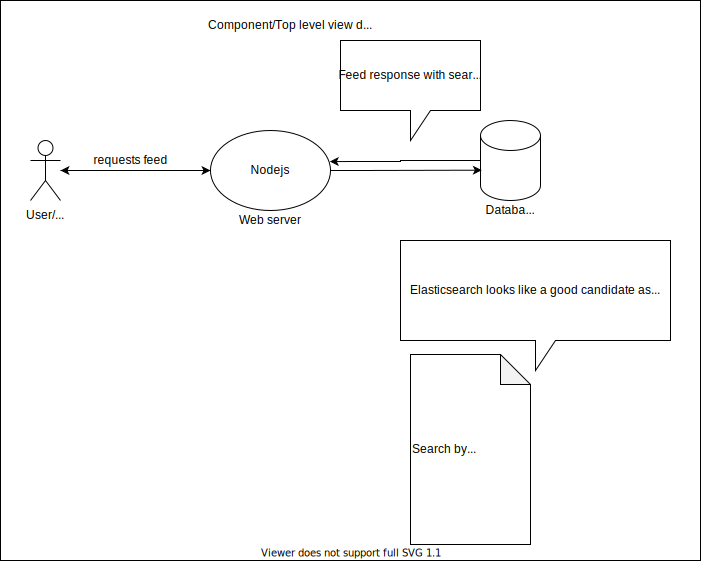
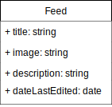
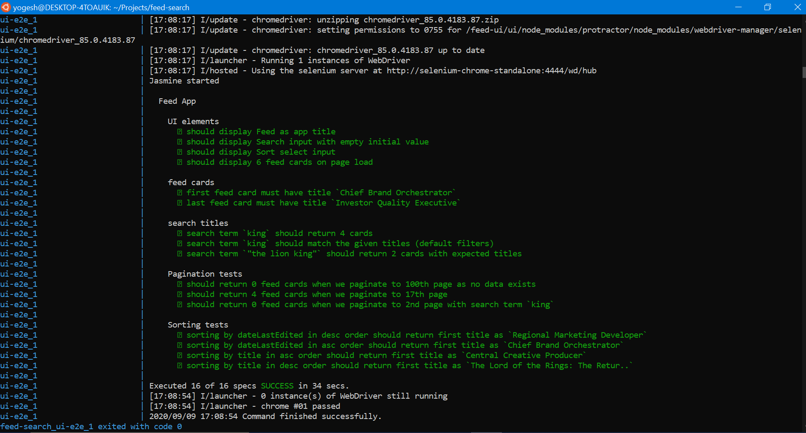
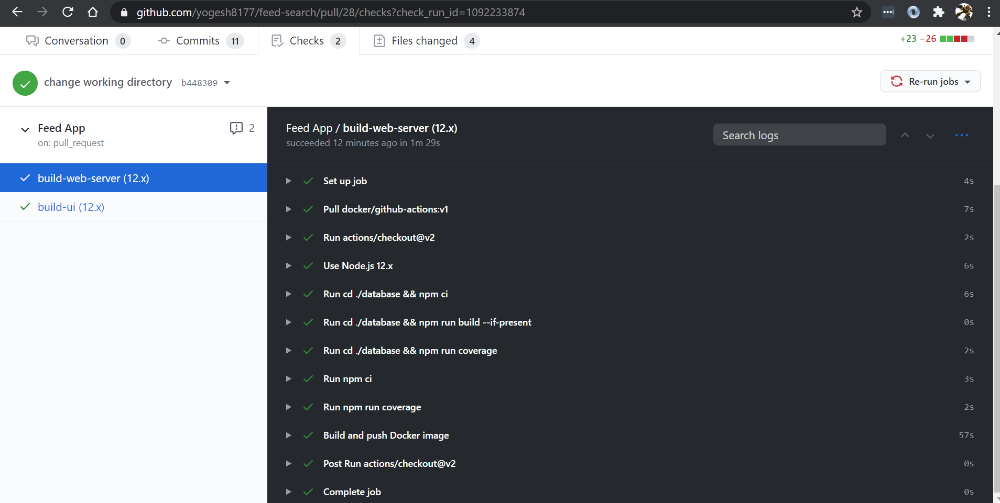
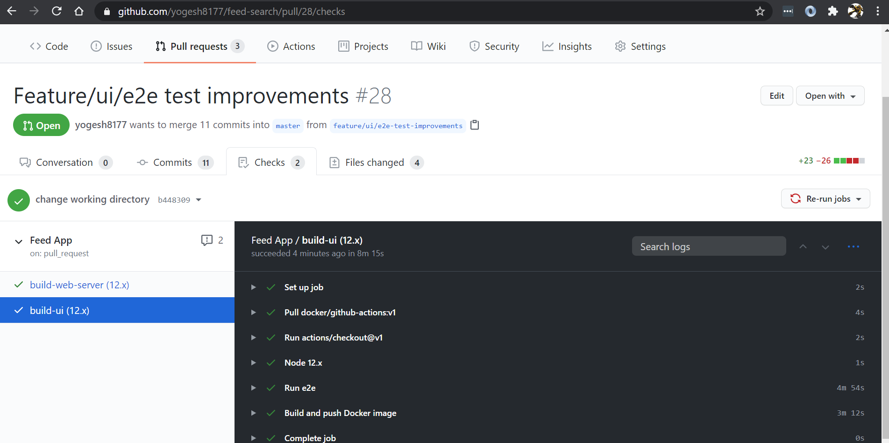
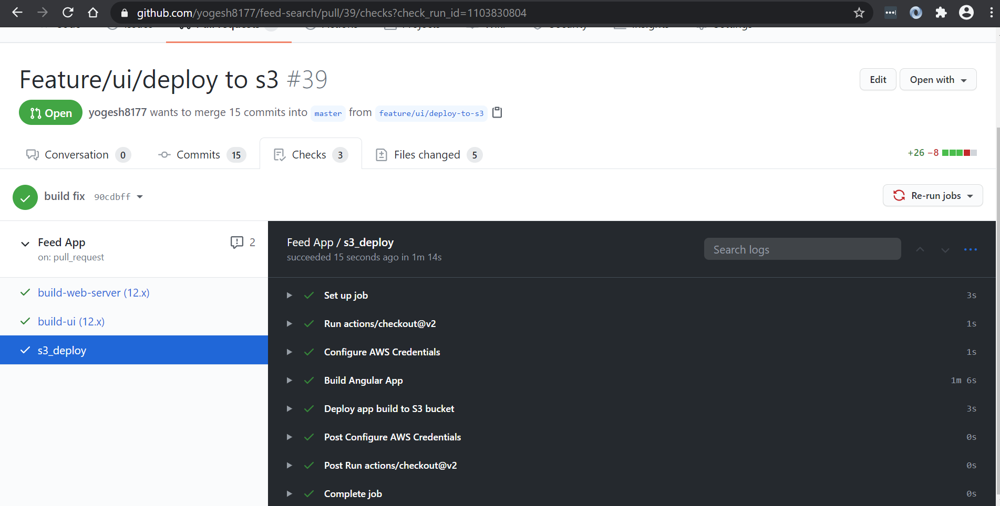

# Feed-search
This is a `POC` for searching and sorting feed data along with pagination. This project is set with github actions for `build-test-deploy` actions. There are three core components in this setup:

1. In memory database
1. Web server
3. Angular UI

# Live demo

[Feed search App](http://feed-search.ytechspark.com/)

# Architecture/Component diagram


# Feed class diagram


Above figure represents our `Feed` class which we will be implementing.

# Database engine (Search engine) [](https://github.com/yogesh8177/feed-search/actions)

We have our in memory database which we will use to store mock data. Following are the features for this database engine:
1. It creates inverted index by tokenizing fields.
    1. Tokens are cleaned and lowercased.
    1. We remove `[.:]` chars to clean our tokens.
    1. We also index phrases, however we only consider a phrase consisting of utmost 4 words
    1. This engine expects that the text contains single space between words, so make sure to sanitize input.
    1. Creates `nGram` based inverted index for the indexed fields by default.

1. Our engine is located at `$PROJECT_ROOT/database` folder.
1. You can run tests for as follows:
    1. `cd database`
    1. `npm install`
    1. `npm run test`

# Nodejs Webserver [](https://github.com/yogesh8177/feed-search/actions)

We have our webserver that will host the in-memory database mentioned earlier. It will auto initialize the `mock data` and necessary `data structures` as given below which are necessary to start querying our data.

```json
Initialized in memory db [
  "documentId",
  "documentsMap",
  "invertedIndex",
  "maxPageSize",
  "dateLastEditedIndex",
  "titleIndex"
]
```
Below are steps to run our web server:
1. Server is located at: `$PROJECT_ROOT/server.js`
1. `cd ..` # In previous step, we were inside database folder
1. `npm install`
1. `npm test`
1. `npm start`

>Note: Server will be listening at `http://localhost:8000/feed?page=1&pageSize=6&sortField=dateLastEdited&type=Date&order=asc&searchTerm=`

Following are some useful endpoints for debugging and refreshing site content

1. `http://localhost:8000/test` this endpoint will be useful for health checks.
1. `http://localhost:8000/refresh` this endpoint will reload search engine data from the data source.

# Angular UI [](https://github.com/yogesh8177/feed-search/actions)

Our UI code is situated at `$PROJECT_ROOT/ui` folder.
Follow the steps below to run the UI:

1. `cd ui`
1. `npm install -g @angular/cli`
1. `npm install`
1. `ng serve`

You can now view the app at: `http://localhost:4200`

>Note: Make sure you are already running the web server so as to fetch the data.

# e2e tests

## Local run (headless)

Assuming you have ran all the steps mentioned in Angular ui section, follow the given steps.

1. `npm start` # start web server
1. `cd ui`
1. `./node_modules/protractor/bin/webdriver-manager update`
1. `ng e2e -c local-e2e`

> Note: Make sure you have java and chrome installed, else the tests won't work!

## Local run (Chrome direct)

Assuming you have ran all the steps mentioned in Angular ui section, follow the given steps.

1. `npm start` # start web server
1. `cd ui`
1. `./node_modules/protractor/bin/webdriver-manager update`
1. `ng e2e -c local-chrome-direct-e2e`

> Note: Make sure you have java and chrome installed, else the tests won't work!

# Docker e2e

1. Make sure you download and install `docker` and `docker-compose` on your system.
1. Our `docker-compose.yml` is present at `$PROJECT_ROOT/docker-compose.yml` directory;
1. Run: `docker-compose up -d` OR `sudo docker-compose up -d`
1. Run: `docker-compose logs -f ui-e2e` to follow and view e2e logs in action

Below is a sample of dockerized e2e test logs:



# CI/CD (Github actions)

We have two builds for building webs server and ui as follows:

1. `build-web-server (12.x)` builds web server for node 12.x and `build + push` docker image to docker hub.

1. `build-ui (12x)` builds ui using node 12.x and `build + e2e + push` docker image to docker hub.

1. Deploy angular prod build to `S3` bucket.
